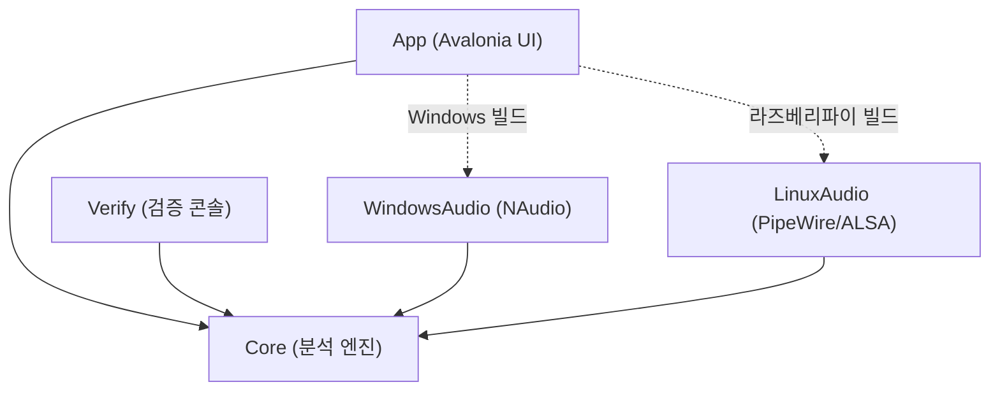
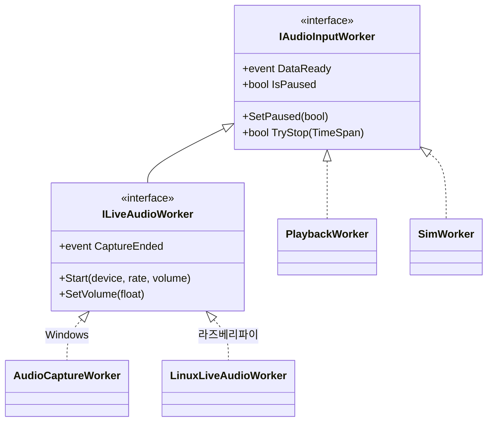
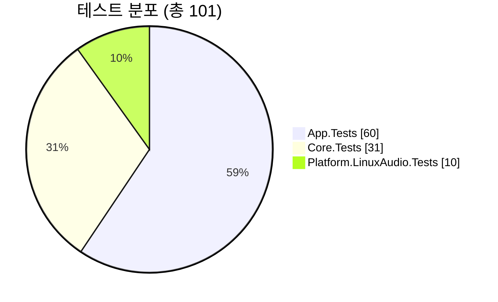

# TimeGrapherNet

기계식 시계의 똑딱 소리를 마이크로 듣고, 시계가 얼마나 정확한지를 실시간으로 분석해 그래프로
보여 주는 데스크톱 앱입니다. 기존 Qt/C++ 버전을 **Avalonia + C# (.NET 8)** 로 다시 만들어,
같은 코드로 **Windows**와 **라즈베리파이 5**에서 모두 동작합니다.

화면에 실시간으로 보여 주는 값:

- **BPH** — 시계 박자(시간당 진동수)
- **레이트 오차(s/d)** — 하루에 몇 초 빠른지/느린지
- **비트 에러(ms)** — 똑/딱 간격의 불균형
- **진폭(°)** — 밸런스 휠이 흔들리는 각도

## 주요 기능

- 똑/딱 소리를 검출해 박자(BPH)를 자동·수동으로 잡고, 위상 추적으로 동기를 유지.
- 화면 탭 2종:
  - **Rate/Scope** — 파형·트리거 선과 박자 흐름 그래프
  - **Sound Print** — 소리를 박자 주기로 접어 그린 이미지
- 입력 3종: **Live**(마이크), **Playback**(WAV 파일 재생), **Sim**(합성 신호).
- 분석과 동시에 입력을 WAV로 녹음.
- 화면 없이 검출 정확도·오디오 장치를 점검하는 콘솔 모드.

## 구조

분석 엔진(`Core`)은 UI·OS에 전혀 의존하지 않습니다. OS별 오디오 기능만 갈아 끼우면 되고, 이
경계는 CI가 자동으로 검사합니다.



*그림 1. 모든 프로젝트가 Core를 참조하고, 오디오 백엔드는 빌드 대상 OS에 맞는 것만 포함됩니다.*

소리가 화면에 그려지기까지의 흐름:


*그림 2. 입력 → 검출 → 측정 → 시각화. 분석 한 번이 화면 갱신 한 번으로 이어집니다.*

### 입력 워커 계약

세 가지 입력(Live·Playback·Sim)은 공통 `IAudioInputWorker`(일시정지·정지·데이터 준비)를
구현합니다. 마이크 입력만 `ILiveAudioWorker`로 장치 선택·볼륨·캡처 종료를 더합니다. Core는 이
작은 계약만 알면 되므로, OS별 백엔드를 자유롭게 끼울 수 있습니다.



*그림 3. 입력 워커 계층. 마이크 백엔드는 OS별 어셈블리에 구현됩니다.*

## 프로젝트 구성

| 프로젝트 | 역할 |
|---|---|
| `TimeGrapher.Core` | 분석 엔진 — 검출·측정·이미지 생성·WAV 읽기/쓰기·시뮬레이터 (UI·OS 비의존) |
| `TimeGrapher.App` | Avalonia UI — 창·탭·그래프 표시, OS별 오디오 연결 |
| `TimeGrapher.Platform.WindowsAudio` | Windows 마이크 입력 (NAudio) |
| `TimeGrapher.Platform.LinuxAudio` | 라즈베리파이 마이크 입력 (PipeWire → ALSA) |
| `TimeGrapher.Verify` | 화면 없이 WAV의 BPH 검출 정확도를 확인하는 콘솔 |
| `*.Tests` | xUnit 테스트 (Core / App / LinuxAudio) |

자세한 설계 배경과 Qt→.NET 포팅 과정은 `docs/` 폴더를 참고하세요.

## 빌드 / 실행

요구: .NET SDK 8.0.421 이상.

```powershell
dotnet restore TimeGrapherNet.sln --locked-mode
dotnet build TimeGrapherNet.sln -c Release
dotnet test  TimeGrapherNet.sln -c Release
dotnet run --project src/TimeGrapher.App          # GUI 실행
```

WAV 파일의 검출 정확도만 콘솔로 확인:

```powershell
dotnet run --project src/TimeGrapher.Verify -c Release -- --generated --byte-fixtures
```

### 라즈베리파이 5 배포

```powershell
dotnet publish src/TimeGrapher.App/TimeGrapher.App.csproj -c Release -r linux-arm64 --self-contained true
```

- GUI 실행에 필요한 패키지: `libx11-6`, `libice6`, `libsm6`, `libfontconfig1`, `xwayland`.
- 마이크 입력은 PipeWire(`pw-record`)를 먼저 쓰고, 없으면 ALSA(`arecord`)로 대체합니다.
- 화면 없이 점검: `./TimeGrapher.App --smoke`(앱 초기화), `--audio-smoke`(장치 목록),
  `--capture-smoke`(짧게 캡처).
- 작업표시줄 아이콘 등록은 `deploy/linux/README.md` 참고.

### 기술 스택

| 패키지 | 버전 | 용도 |
|---|---|---|
| Avalonia(.Desktop/.Themes.Fluent/.Fonts.Inter) | 11.3.2 | UI 프레임워크 |
| ScottPlot.Avalonia | 5.0.55 | 스코프/레이트 그래프 |
| NAudio.Wasapi / NAudio.WinMM | 2.2.1 | Windows 마이크 캡처·볼륨 |
| Tmds.DBus.Protocol | 0.21.3 | Linux 오디오 보조 |
| xunit / xunit.runner.visualstudio | 2.9.2 / 2.8.2 | 테스트 |
| Microsoft.NET.Test.Sdk | 17.12.0 | 테스트 호스트 |

패키지 버전은 `Directory.Packages.props`에서 중앙 관리하고, `packages.lock.json`으로 고정해
항상 같은 버전으로 복원합니다.

## 테스트 / CI

`dotnet test` 기준 **101개 테스트 전부 통과**(App 60 / Core 31 / LinuxAudio 10).



*그림 4. 테스트 분포.*

GitHub Actions(`.github/workflows/ci.yml`)가 push/PR마다 Ubuntu·Windows 두 환경에서 빌드·테스트와
WAV 검출 검증, 그리고 라즈베리파이·Windows용 배포 산출물 생성을 자동 실행합니다.

## 체크리스트

| 항목 | 명령 | 상태 |
|---|---|---|
| 빌드 | `dotnet build TimeGrapherNet.sln -c Release` | ✅ |
| 테스트 | `dotnet test TimeGrapherNet.sln -c Release` (101/101) | ✅ |
| 검출 검증 | `... TimeGrapher.Verify -- --generated --byte-fixtures` (exit 0) | ✅ |
| GUI 실행 | `dotnet run --project src/TimeGrapher.App` | ✅ |
| 라즈베리파이 배포 | `dotnet publish ... -r linux-arm64 --self-contained true` | ✅ |
| 라즈베리파이 마이크 입력 | 캡처 장치 연결 후 검증 | ⏳ 장치 대기 |
